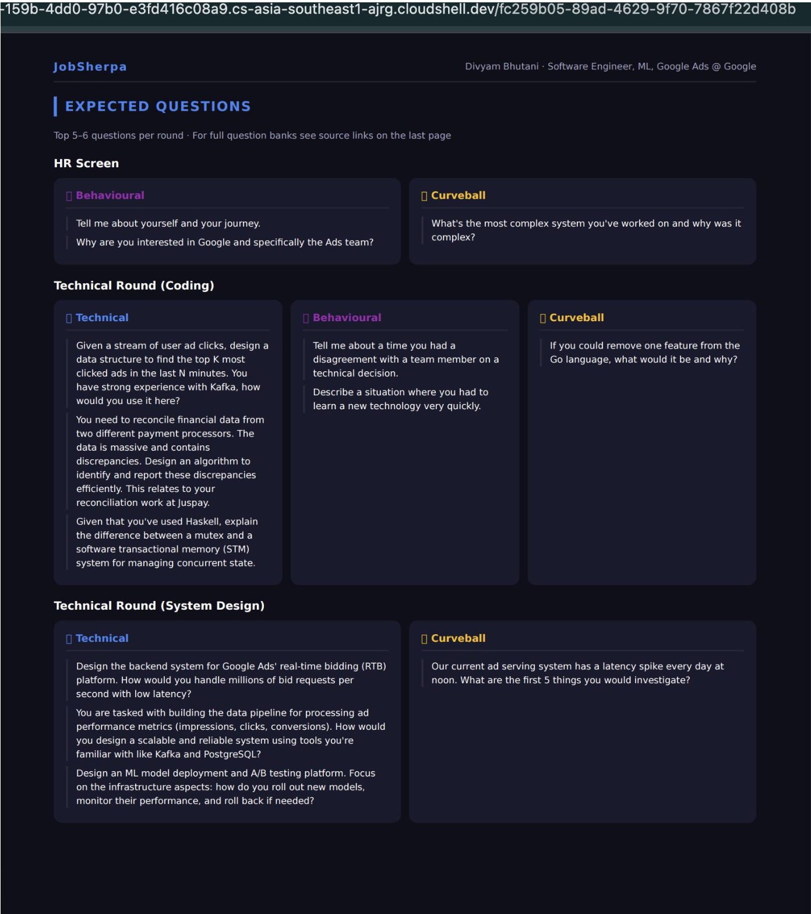

# JobSherpa — AI-Powered Resume-to-Job Matchmaker

> Your guide through the job hunt climb.

JobSherpa is an agentic AI application built on Google ADK that takes your resume (PDF) and a job description, then produces a visually rich, dark-themed PDF report with match analysis, interview roadmap, expected questions, and salary intelligence — all in one click.

---

## What It Does

Upload your resume and paste a job description (or a URL). JobSherpa's AI agent:

1. **Parses your resume** — extracts skills, experience, projects, and all links
2. **Researches the company** — scrapes Glassdoor, AmbitionBox, Reddit, Levels.fyi and more for real interview experiences and salary data
3. **Scores the match** — radar chart across 5 dimensions, ATS keyword score, skill gap analysis
4. **Builds an interview roadmap** — round-by-round breakdown with tailored questions
5. **Delivers salary intelligence** — India and global bands, CTC breakdown, negotiation tips
6. **Generates a PDF** — dark-themed, visual-first report delivered as a downloadable artifact

---

## Screenshots

### Agent Running in ADK Web UI


### Match Analysis — Radar Chart, Skill Pills, ATS Score


### Interview Roadmap — Visual Timeline + Round Details


### Expected Questions — Per Round, Per Type


---

## Tech Stack

| Layer | Technology |
|---|---|
| Agent Framework | [Google ADK](https://google.github.io/adk-docs/) (`google-adk`) |
| LLM | Gemini 2.5 Pro via Vertex AI |
| Web Search | [Serper API](https://serper.dev) — structured results with dates |
| Scraping | [Scrapling](https://github.com/D4Vinci/Scrapling) — StealthyFetcher for Cloudflare sites |
| Resume Parsing | PyMuPDF (`pymupdf`) |
| PDF Generation | WeasyPrint (HTML + CSS → PDF) |
| Charts | matplotlib — radar, donut, bar, speedometer |
| Template Engine | Jinja2 |

---

## Project Structure

```
job_sherpa/
├── job_sherpa_agent/             # ADK module (name must match for adk web)
│   ├── agent.py                  # Agent definition, tool wiring, system prompt
│   ├── tools/
│   │   ├── resume_parser.py      # PDF → text + links via ADK artifact system
│   │   ├── jd_fetcher.py         # URL → job description text
│   │   ├── serper_search.py      # Query → ranked URLs with freshness filtering
│   │   ├── scraper.py            # URL → full page content (stealth + dynamic)
│   │   ├── link_validator.py     # HTTP checks on all resume links
│   │   └── __init__.py
│   ├── report/
│   │   ├── pdf_generator.py      # Renders HTML template → PDF artifact
│   │   ├── chart_generator.py    # All matplotlib charts (7 chart types)
│   │   └── templates/
│   │       └── report.html       # Jinja2 dark-theme HTML template
│   ├── assets/
│   │   └── branding.md
│   └── requirements.txt
├── docs/screenshots/             # README screenshots
├── .env.example                  # Blank env template — safe to commit
├── .gitignore
├── requirements.txt
└── claude.md                     # Project context for AI-assisted development
```

---

## PDF Report Pages

| Page | Content |
|---|---|
| 1 — Cover | Candidate name, role, company, speedometer match score |
| 2 — Match Analysis | Radar chart, shining points, skill pills (matched/missing/bonus), ATS score |
| 3 — Interview Roadmap | Visual timeline + per-round breakdown (what they evaluate, how to prep) |
| 4 — Expected Questions | Technical, Behavioural, Curveball cards per round |
| 5 — Salary Intelligence | India + Global bands, CTC donut chart, negotiation tips |
| 6 — Sources & Confidence | Dot-based confidence ratings, source URLs |

---

## Getting Started

### Prerequisites
- Python 3.10+
- Google Cloud project with Vertex AI enabled
- [Serper API key](https://serper.dev) (free tier available)

### Setup

```bash
# Clone the repo
git clone <repo-url>
cd job_sherpa

# Create and activate virtual environment
python -m venv .venv
source .venv/bin/activate

# Install dependencies
pip install -r requirements.txt

# Set up environment variables
cp .env.example job_sherpa_agent/.env
# Edit job_sherpa_agent/.env and fill in your values
```

### Run

```bash
adk web
```

Open [http://localhost:8000](http://localhost:8000), upload your PDF resume, and paste the job description or a link to the job posting.

---

## Environment Variables

Copy `.env.example` to `job_sherpa_agent/.env` and fill in:

| Variable | Description |
|---|---|
| `GOOGLE_API_KEY` | Google Cloud API key |
| `GOOGLE_CLOUD_PROJECT` | Your GCP project ID |
| `SERPER_API_KEY` | Serper.dev API key for web search |
| `GOOGLE_GENAI_USE_VERTEXAI` | Set to `TRUE` to use Vertex AI backend |

---

## Architecture

JobSherpa uses a **single-agent architecture** — one Gemini agent orchestrating multiple deterministic tool functions. No sub-agents.

```
User uploads resume + JD
        ↓
  parse_resume()          ← PyMuPDF reads PDF via ADK artifact
        ↓
  fetch_jd()              ← Scrapling fetches JD from URL (if provided)
        ↓
  serper_search() ×N      ← Find interview + salary URLs via Serper
        ↓
  scrape_content() ×N     ← Deep scrape top URLs (stealth where needed)
        ↓
  Gemini synthesizes      ← Structured JSON with all analysis
        ↓
  generate_pdf()          ← WeasyPrint renders HTML → PDF artifact
        ↓
  Download link in chat
```

**Scraping routing:**
- Glassdoor, AmbitionBox → `StealthyFetcher` (bypasses Cloudflare)
- Levels.fyi → `DynamicFetcher` (JS-rendered)
- Reddit, Medium, everything else → regular `Fetcher`

---

## Data Sources

JobSherpa researches these sources at runtime:

- **Interview experiences** — Glassdoor, Reddit, Medium, LeetCode Discuss
- **Salary (India)** — AmbitionBox, Glassdoor India, Naukri, LinkedIn Salary
- **Salary (Global)** — Levels.fyi, Glassdoor

All results are filtered to the last 3 years for freshness.

---

## Built for Google Gen AI Hackathon 2026
