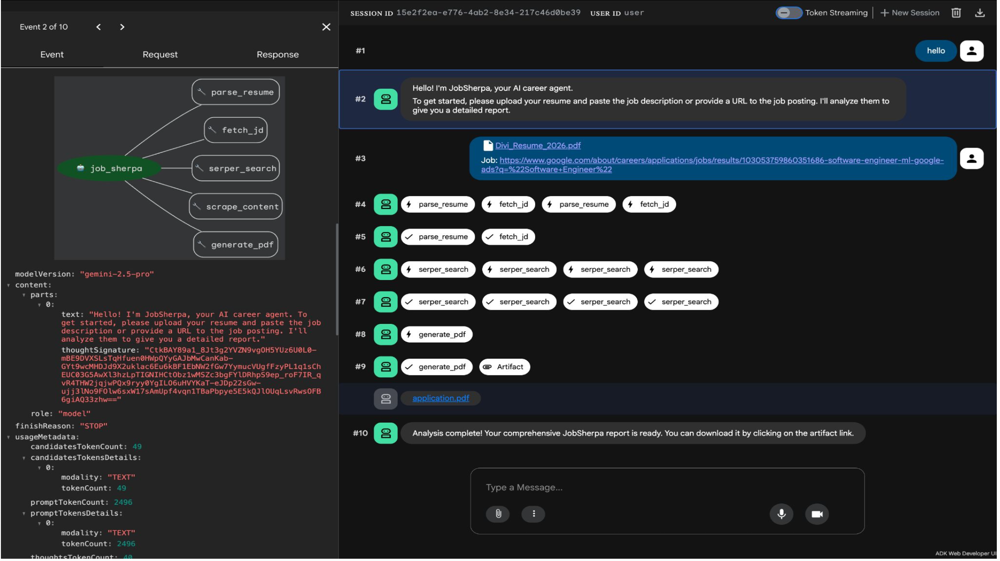
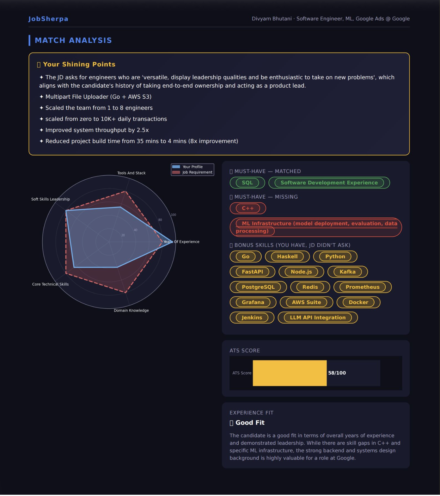
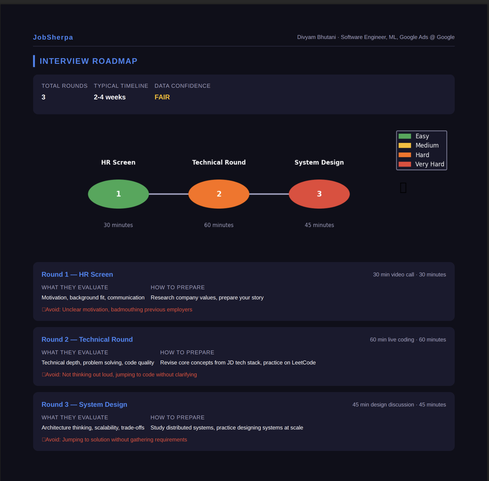

# JobSherpa — AI-Powered Resume-to-Job Matchmaker

> Your guide through the job hunt climb.

Upload your resume (PDF) and a job description (text or URL). JobSherpa's AI agent scrapes real interview and salary data, then delivers a dark-themed PDF report with match analysis, interview roadmap, expected questions, and salary intelligence.

---

## Screenshots

| ADK Web UI | Match Analysis |
|---|---|
|  |  |

| Interview Roadmap | Expected Questions |
|---|---|
|  |  |

---

## Tech Stack

| Layer | Technology |
|---|---|
| Agent Framework | [Google ADK](https://google.github.io/adk-docs/) |
| LLM | Gemini 2.5 Pro via Vertex AI |
| Web Search | [Serper API](https://serper.dev) |
| Scraping | [Scrapling](https://github.com/D4Vinci/Scrapling) |
| Resume Parsing | PyMuPDF |
| PDF Generation | WeasyPrint + Jinja2 + matplotlib |

---

## Setup

**Prerequisites:** Python 3.10+, GCP project with Vertex AI enabled, Serper API key

```bash
git clone <repo-url> && cd job_sherpa
python -m venv .venv && source .venv/bin/activate
pip install -r requirements.txt
cp .env.example job_sherpa_agent/.env
# Fill in your values in job_sherpa_agent/.env
adk web
```

Open [http://localhost:8000](http://localhost:8000), upload your resume, and paste the job description or URL.

---

## Environment Variables

| Variable | Description |
|---|---|
| `GOOGLE_API_KEY` | Google Cloud API key |
| `GOOGLE_CLOUD_PROJECT` | GCP project ID |
| `SERPER_API_KEY` | Serper.dev API key |
| `GOOGLE_GENAI_USE_VERTEXAI` | Set to `TRUE` |

---

## Data Availability

JobSherpa scrapes publicly available data at runtime. Output quality varies by section:

| Section | Status |
|---|---|
| Match Analysis & ATS Score | Always available — derived from resume + JD |
| Shining Points | Always available — derived from resume |
| Interview Rounds & Questions | Best-effort — scraped from Glassdoor, Reddit, LeetCode Discuss. Falls back to JD-based AI generation if no data found |
| Salary Intelligence | Best-effort — scraped from AmbitionBox, Levels.fyi, Glassdoor. Shows N/A for niche companies or roles with no public data |
| Link Validation | Implemented but not yet wired into the agent — section will be empty in current reports |

> Glassdoor and AmbitionBox are behind Cloudflare and login walls. Salary and interview data for smaller companies or newer roles may be limited.
